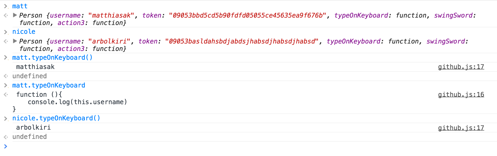
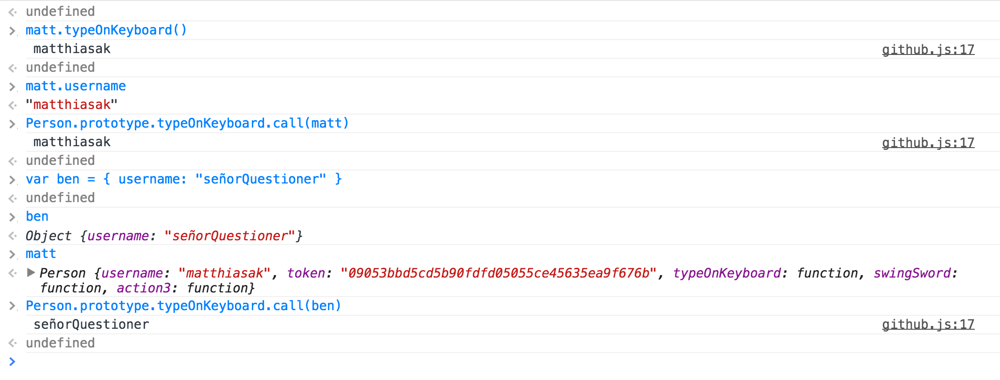

# Week 3

# Objectives

1. [Resources](#resources)
- [Arrays](#arrays)
- [Date()](#date)
- [String methods](#string-methods)
- [Regular Expressions (or RegEx for short)](#regular-expressions-or-regex-for-short))
- [DOM APIs](#dom-apis)
- [jQuery's AJAX functions](#jquerys-ajax-functions)
- [Promises, `$.Deferred`, `$.get/getJSON/ajax/post`](#Promises, `$.Deferred`, `$.get/getJSON/ajax/post`)
- [DOM Events, `addEventListener()`, and `$.on()`](#DOM Events, `addEventListener()`, and `$.on()`)
- [Combining DOM APIs, loops, and strings to dynamically change content on a Github page](#Combining DOM APIs, loops, and strings to dynamically change content on a Github page)
- [`setInterval()`, `setTimeout()`](#`setInterval()`, `setTimeout()`)
- [Implicit Type coercion](#Implicit Type coercion)
- [Automatic Semicolon Insertion](#Automatic Semicolon Insertion)
- [debugger with Chrome](#debugger with Chrome)
- [errors, try/catch/finally, throw](#errors, try/catch/finally, throw)
- [`arguments` (variadic behavior)](#`arguments` (variadic behavior))
- [Inheritance / OOP](#Inheritance / OOP)
- [Underscore / lodash](#Underscore / lodash)
- [Making Video Games in JavaScript](#Making Video Games in JavaScript)
- [Prototypes, Constructors, and Organizing Code](#prototypes-constructors-and-organizing-code)
- [RESTful APIs](#restful-apis)
- [Routing](#routing)
- [Script Loaders](#script-loaders)
- [Polyfills](#polyfills)
- [Caching](#caching)
- [More on Inheritance](#more-on-inheritance)

---

# Discussion Topics and Homework

### (1.) Monday

**Homework**

1. MLK Day - keep doing weekend assignment.

### (2.) Tuesday

**Homework**

1. [Color Clock](https://github.com/matthiasak/js-assignments/tree/master/color-clock)

### (2.) Wednesday

- AJAX, Promises, and Github API (https://api.github.com/)

**Homework**

1. Review https://github.com/TIY-Houston-Front-End-Engineering/AJAX-1
2. [Github profile](https://github.com/matthiasak/js-assignments/tree/master/github-api-profile)
3. Blog something.

### (2.) Thursday

**Homework**

- http://www.staticshowdown.com/

---

# Resources

- http://onepagelove.com/
- http://sass-lang.com/guide
- https://www.npmjs.org/
- https://github.com/jonathanpath/SASS-SMACSS
- http://bonsaiden.github.io/JavaScript-Garden/
- http://devdocs.io/
- Mozilla Developer Network: https://developer.mozilla.org/en-US/
- http://blog.keithcirkel.co.uk/how-to-use-npm-as-a-build-tool/
- https://developer.mozilla.org/en-US/docs/Web/Reference/API
- https://developer.mozilla.org/en-US/docs/Web/JavaScript
- https://leanpub.com/understandinges6/read/
- http://blog.andyet.com/2014/08/13/opinionated-rundown-of-js-frameworks
- https://github.com/PROSPricing/js-assessment/tree/master/app
- https://github.com/enaqx/awesome-react
- http://futurice.com/blog/reactive-mvc-and-the-virtual-dom
- https://gist.github.com/staltz/868e7e9bc2a7b8c1f754
- http://backbonejs.org
- https://github.com/instanceofpro/awesome-backbone
- https://github.com/h5bp/Front-end-Developer-Interview-Questions/blob/master/README.md
- http://youmightnotneedjquery.com/
- https://github.com/Modernizr/Modernizr/wiki/HTML5-Cross-Browser-Polyfills
- http://caniuse.com/

---

# Arrays

- creating arrays

    ```js
    var names = ['matt', 'mark', 'mike'];

    // or

    var names = new Array(3);
    name[0] = 'matt';
    name[1] = 'mark';
    name[2] = 'mike';
    ```

- array methods and properties

    - `length`
    - `indexOf` / `lastIndexOf`
    - `push` / `pop`
    - `unshift` / `shift`
    - `join`
    - `forEach`
    - `sort`
    - `reverse`
    - `slice`
    - `filter`
    - `map`
    - `reduce`
    - `concat`

    ```js
    var fruits = [{
        name: "apple",
        color: "red"
    }, {
        name: "strawberry",
        color: "red"
    }, {
        name: "tomato",
        color: "red"
    }, {
        name: "grape",
        color: "red"
    }]

    fruits = fruits.filter(function(fruit){
        return fruit.color === "red";
    }).map(function(fruit){
        return fruit.name;
    })

    console.log(fruits.join(", "));
    ```

# Date()

```js
var x = new Date(),
    y = new Date(1421298156652),
    z = new Date("Wed Jan 14 2015");
    // new Date(year, month[, day[, hour[, minute[, second[, millisecond]]]]]);
```

> See more http://devdocs.io/javascript-date/

# String methods

```js
"a".anchor("test")
"a".bold()
"hello there!".link("test"); //<-- "<a href="test">hello there!</a>"


"    Hi! I'm a string. ".trim(); //<-- "Hi! I'm a string."

"hello".charAt(0); //<-- "h"
"hello"[0]; //<-- "h"

"a".charCodeAt(0); //<-- 97
"b".charCodeAt(0); //<-- 98
"Z".charCodeAt(0); //<-- 90

"Z" < "a"; //<-- true (because "Z"'s charcode is less than "a"' charcode)

String.fromCharCode(97); //<-- "a"

"howdy".indexOf("o"); //<-- 1
"howdy".indexOf("ow"); //<-- 1
"howdy".indexOf("nope"); //<-- -1

"hello there!".length; //<-- 12

"howdy".replace("owd", "ey bab"); //<-- "hey baby"

"hi mi fli whi GI Ri Shi".replace(/i/, "a"); //<-- "ha mi fli whi GI Ri Shi"
"hi mi fli whi GI Ri Shi".replace(/i/ig, "a"); //<-- "ha ma fla wha Ga Ra Sha"
"hi mi fli whi GI Ri Shi".replace(/hi/ig, "a"); //<-- "a mi fli wa GI Ri Sa"

"a-b-c".split(""); //<-- ["a", "-", "b", "-", "c"]
"a-b-c".split("-"); //<-- ["a", "b", "c"]

"hello there!".substr(0, 5); //<-- "hello"
"hello there!".substr(1, 5); //<-- "ello "
"hello there!".substr(2, 5); //<-- "llo t"
"hello there!".substr(3, 5); //<-- "lo th"
"hello there!".substr(4, 5); //<-- "o the"
"hello there!".substr(5, 5); //<-- " ther"
"hello there!".substr(6, 5); //<-- "there"

"i'M AlL FuNKy LoOkINg".toLowerCase(); //<-- "i'm all funky looking"
"i'M AlL FuNKy LoOkINg".toUpperCase(); //<-- "I'M ALL FUNKY LOOKING"
```

# Regular Expressions (or RegEx for short)

In JS, there is a `RegExp` Object. RegEx is used to test for patterns in strings (i.e. the `type="email"` and `pattern="[a-zA-Z]+"` attributes on an HTML element uses RegEx to **test for matches**).

We will use RegEx most often through two primary approaches:

1. We know a string `x`, and would like to test for any occurrences of a RegExp `y`,
- or we know a RegExp `y` and would like to find the matches (if any) from a string `x`

**Example 1**

- The dot (.) matches any character. If you want to match the dot as a character, escape it like this: \.
- A question mark (?) means that the preceding character is optional. If you want to match an actual question mark, escape it: "\?"
- The star (*) matches 0 or more characters
- The plus (+) matches 1 or more characters
- The parens () group states together
- The square brackets [] define a character-group
- The ^ at the front of a character-group [] means "not"
- The "/g" at the end of the RegEx object means "global", so `.match()` returns an array of matches instead of just one
- The "\d" means "decimal", and "\D" means "not a decimal"
- {x} for an exact number of repetitions, {x,y} for varying number of repetitions (where x and y are numbers)
- Also, there is the special "\b" pattern which matches the boundaries at the ends of words (not a real symbol).

```javascript
var text = 'The eyes of Texas are upon you.';

// Will match both "elit" and "elat". The dot can match any character.
var regex = /./g;
console.log( text.match(regex) );

// Will match both "est" and "lest". The question mark makes "l" optional.
var regex2 = /l?est/g;
console.log( text.match(regex2) );

// Match only "cat" and "can", but not "car".
var text = 'cat car can';
console.log( text.match(/ca[tn]/g) );

// Match everything BUT cat and can (notice the ^ symbol)
console.log( text.match(/ca[^tn]/g) );

// Here is another example, which matches only the number
text = 'I would like 8 cups of coffee, please.';
console.log('How many cups: ' + text.match( /[0-9]/g ));

// A better, shorter way to write it, using the \d character class
console.log('How many cups: ' + text.match( /\d/g ));

// Matching everything BUT the number (will return an array of chars)
console.log( text.match(/\D/g) );

//////////--------------

text = 'Hello people of 1974. I come from the future. In 2015 we have laser guns, hover boards and live on the moon!';

// Find the years. \d+ will match one or more chars
var yearRegex = /\d+/g;
console.log('Years: ', text.match( yearRegex ) );

// Find all sentences. Our sentences begin with a capital letter and end in either a dot or an exclamation mark.
// The question mark makes the regex non-greedy. Try removing it.
var sentenceRegex = /[A-Z].+?(\.|!)/g;
console.log('Sentences: ', text.match(sentenceRegex) );

// Find all words that begin with h. We want to match both lower and upper case, so we include the i modifier.
// Notice the \b for word boundary. Try removing it.
var hWords = /\bh\w+/ig;
console.log('H Words: ', text.match(hWords) );


// Find all words between four and six characters
var findWords = /\b\w{4,6}\b/g;
console.log( 'Words between 4 and 6 chars: ', text.match(findWords) );


// Find words longer than 5 chars
console.log( 'Words 5 chars or longer: ', text.match(/\b\w{5,}\b/g) );


// Find words exactly 6 chars long
console.log( 'Words exactly 6 chars long: ', text.match(/\b\w{6}\b/g) );
```

**Example 2**

RegEx keeps track of the groups () it has matched, and automatically numbers them.

```js
// Find the words which consist only of the same letters
var text = 'Abc ddefg, hijk lllll mnopqr ssss. Tuv wxyyy z.';
var sameLetterRegex = /\b(\w)\1*\b/g;
console.log( text.match(sameLetterRegex) );
```

Aside from matching character patterns in strings, we can use RegEx to to substitute text out (think "find and replace" feature of text editors). We can do this with `String.replace()`.

```js
// Let's turn "John Smith" into "Smith, John"
// Each group (\w+) matches a single word. Each group is assigned
// an index, starting from $1
var name = 'John Smith';
var nameRegex = /(\w+) (\w+)/;
console.log( name.replace(nameRegex, '$2, $1') );


// For more advanced manipulations, we need to provide a JS callback.
// For example, lets make the surname uppercase
var upcasename = name.replace(nameRegex, function(string, group1, group2){
    return group2.toUpperCase() + ', ' + group1;
});

console.log( upcasename );
```

# DOM APIs

- `document.querySelector`
- `document.querySelectorAll`
- `document.getElementById`
- `document.getElementByTagName`
- `document.getElementsByClassName`

**what we can edit/read on DOM elements**

- `attributes` on an element `element['attributeName']` (i.e. `element.id`, `element.tagName`, or `element.className`)
- `innerHTML`
- `style`
- and many more...

> See http://devdocs.io/dom/htmlelement for more

# jQuery's AJAX functions

jQuery has some built-in methods of requesting and sending information to and from a server. We covered `$.get()` and `$.getJSON` today. We will get to posting information to a server shortly.

- `$.get(url).then(function(data){...})`

    http://api.jquery.com/jQuery.get/


- `$.getJSON(url).then(function(data){...})`

    http://api.jquery.com/jQuery.getJSON/


- `$.ajax(options).then(function(data){...})`
- `$.post(url).then(function(data){...})`

All of the above methods return a **jQuery Promise** object that has a `then` method. This is how we handle **asynchronous** communications in JavaScript. Promises are used because we don't know when the AJAX request will return (.5s? 1s? 10s? never?).

```js
var githubUsername = "matthiasak";
var url = "https://api.github.com/users/"+githubUsername;
var result = $.get(url);
result.then(function(data){
    // do something with the data retrieved
})
```

# Promises, `$.Deferred`, `$.get/getJSON/ajax/post`

`$.get()` is built on top of a built-in object in JavaScript called `XMLHttpRequest`.

First off, to see how much crazy detail exists for `XMLHttpRequest()`'s, have a look at https://developer.mozilla.org/en-US/docs/Web/API/XMLHttpRequest.

### XMLHttpRequest

Using `XMLHttpRequest` is a bit like this:

```js
var myRequest = new XMLHttpRequest();
myRequest.onload = function(){
    var json = JSON.parse(this.responseText);
    console.log(json);
};
myRequest.open("get", "https://api.github.com/users/matthiasak", true);
myRequest.send();
```

This is actually quite similar to yesterday's `$.getJSON()` example:

```js
$.getJSON("https://api.github.com/users/matthiasak").then(function(data){
    console.log(data);
})
```

### Building our own Promises (but very incomplete)

Both methods still use a `callback` function: `myRequest.onload = ...` and `$.get().then(...)`. This implies some sort of magic that jQuery uses... but really... it isn't magic at all. :-)

Imagine a `Promise` function and prototype:

```js
function Promise(request){}
Promise.prototype.then = function(callback){}
```

Now just assume we can use:

```js
function get(url){
    var myRequest = new XMLHttpRequest();
    var p = new Promise(myRequest);
    myRequest.open("get", url, true);
    myRequest.send();
    return p;
}
````

Then, we can implement the `Promise()` methods:

```js
function Promise(request){
    this.request = request;
}
Promise.prototype.then = function(callback){
    var self = this;
    var feedDataIntoCallback = function(){
        var json = JSON.parse(self.request.responseText);
        callback(json);
    }

    if(this.request.readyState === 4){
        feedDataIntoCallback();
    } else {
        this.request.onload = feedDataIntoCallback;
    }
}
```

Let's string all of that together:

```js
function get(url){
    var myRequest = new XMLHttpRequest();
    var p = new Promise(myRequest);
    myRequest.open("get", url, true);
    myRequest.send();
    return p;
}
function Promise(request){
    this.request = request;
}
Promise.prototype.then = function(callback){
    var self = this;
    var feedDataIntoCallback = function(){
        var json = JSON.parse(self.request.responseText);
        callback(json);
    }

    if(this.request.readyState === 4){
        feedDataIntoCallback();
    } else {
        this.request.onload = feedDataIntoCallback;
    }
}

get("https://api.github.com/users/matthiasak").then(function(data){
    console.log(data);
})
```

Looks a bit more like `$.get()` now!

```js
$.getJSON("https://api.github.com/users/matthiasak").then(function(data){
    console.log(data);
})
```

jQuery provides so much more than `$.get()`. The real power is in the Promises, which are able to not only handle when **one** request finished, but handle **multiple requests in parallel**.

### Handling multiple Promises in parallel

```js
var promise1 = $.get(...);
var promise2 = $.get(...);

$.when(promise1, promise2).then(function(resultsOfPromise1, resultsOfPromise2){
    // ...
})
```

# DOM Events, `addEventListener()`, and `$.on()`

- http://vimeo.com/96425312 ("What is the event loop?")

# Combining DOM APIs, loops, and strings to dynamically change content on a Github page

**Live drawing data pulled from `$.get()` to the DOM**

```js
// ---------------------
// Let's draw some info from our github profiles to the screen
// NOTE: you will need jQuery loaded on the page!
// ---------------------
var githubUsername = "matthiasak";
var url = "https://api.github.com/users/"+githubUsername;
$.get(url).then(function(data){
    drawProfile(data);
})
function drawProfile(data) {
    document.body.innerHTML = [
        '<h1>',
        data.name,
        '</h1>',
        '<h2> blog:',
        data.blog,
        '</h2>'
    ].join('')
}
```

# `setInterval()`, `setTimeout()`

Test the following in Chrome dev tools:

```js
var d = new Date(),
    interval = 3000; //1000ms = 1s

var id = setInterval(function() {
    d.setTime(d.getTime() + interval);
    console.log(d.getHours() + ":" + d.getMinutes() + ":" + d.getSeconds());
}, interval);
```

If you want to make the interval stop executing every 3000ms, run:

```js
clearInterval(id);
```

# Implicit Type coercion

http://bonsaiden.github.io/JavaScript-Garden/#types

- `instanceof` / `typeof`

# Automatic Semicolon Insertion

Read up on this here: http://bonsaiden.github.io/JavaScript-Garden/#core.semicolon

We talked in class about how JavaScript will imply where semicolons should go if you omit them, and where we can omit curly braces (`{}`) with conditional and loop blocks:

```js
// valid one-line loops
for(...) some one line statement;
while(...) some one line statement;

// valid one-line conditionals
if() some one line statement;

// valid for-loop block
for(...){
    some one line statement;
}

// valid if block
if(){
    some one line statement;
}

// valid return statements
return {};
return {}

// not a good return statement

return //<-- ; assumed here, so undefined will be returned, not {a: 0}
    {
        a: 0
    }

// valid function declaration
function(){
    //...
}

// function declaration in an assignment statement, semicolon recommended
var x = function(){};
```

# debugger with Chrome

- `console.log()`
- `console.assert()`
- `console.count()`
- `console.dir()`
- `console.trace()`
- `console.time()`/`console.timeEnd()`
- `performance.now()`
- `console.timeline()`/`console.timelineEnd()`
- `console.profile()`/`console.profileEnd()`
- `inspect(any html element, or function)`
- `console.timeStamp()` - // label the timeline
- `copy()` - copy an object as a string to clipboard

more info: https://developer.chrome.com/devtools/docs/console-api

# errors, try/catch/finally, throw

```
/**
 * EXAMPLE: when asking the user for a number
 */

function askForANumber(){
    var number = prompt("please provide a number");
    try {
        handleResponse(number);
    } catch(e) {
        // :mindblown:
        console.log(e, e.stack);
        askForANumber(); // recursion
    }
}

function handleResponse(number){
    number = parseFloat(number); // handle decimal places too, with parseFloat
    if(typeof number !== "number" || Number.isNaN(number)){ // is it not a number or is it NaN?
        throw new Error("Whatch'you talkin' bout? SAY WAT AGAIN."); // if yes, throw error
    } else {
        alert('You typed in a number: '+number+'!');
    }
}

askForANumber();
```

# `arguments` (variadic behavior)

```js
/**
 * sum functions
 */
function sumOnlyTwoNumbers(a, b){
    "use strict";
    return a + b;
}
function sumForLoop(){
    "use strict";
    var args = Array.prototype.slice.apply(arguments, []),
        sum = 0;
    for(var i = 0; i < args.length; i++){
        sum += args[i];
    }
    return sum;
}
function sumForEach(){
    "use strict";
    var args = Array.prototype.slice.apply(arguments, []),
        sum = 0;
    args.forEach(function(num){ sum += num; });
    return sum;
}
function sumForEachCustom(){
    "use strict";
    "use strict";
    var args = Array.prototype.slice.apply(arguments, []),
        sum = 0;
    forEach(args, function(){ sum += arguments[0]; });
    return sum;
}

/**
 * forEach functions
 */
function forEach(array, callback){
    "use strict";
    for(var i = 0; i < array.length; i++){
        callback(array[i], i);
    }
}
Array.prototype.forEach = function(callback){
    "use strict";
    for(var i = 0; i < this.length; i++){
        callback(array[i], i);
    }
}
```

# Inheritance / OOP

> http://bonsaiden.github.io/JavaScript-Garden/#object.prototype

```js
    base = new Base();
    Derived.prototype = base; // Must be before new Derived()
    Derived.prototype.constructor = Derived; // Required to make `instanceof` work
```

```js
    function Character(name){
        this.name = name;
    }

    Character.prototype.fight = function(){
        console.log(this.name, this.power);
    }

    function Wizard(name){
        Character.apply(this, arguments);
        this.power = 10;
    }

    Wizard.prototype = new Character();
    Wizard.prototype.constructor = Wizard;
```

# Underscore / lodash

Underscore (http://underscorejs.org/, `bower install underscore`) and lodash (https://lodash.com/, `bower install lodash`) are two sides of the same coin.

People originally used Underscore for two reasons:
- in older browsers, it gave us the ability to use `_.forEach()` even though they don't have ES5 (which provides functions like `Array.prototype.forEach`, etc)
- it also provided a TON of utility functions that today I see as essential to the JavaScript developer's toolbelt

Sometime later, lodash came along and stole the show. Lodash happens to have all the exact same functions AND signatures: (i.e. it also gets stored on a global variable `_` with methods like `_.forEach()`). Lodash simply is faster, which is why I prefer it.

Many of the functions from our previous homework are actually implemented in lodash: https://lodash.com/docs

That means `_.forEach`, `_.filter`, `_.reduce`, `_.map`, `_.where`, `_.reject`, etc are all there. Yey! :yey:

One thing I will focus on today with lodash is new: `_.template`, which can be used to plug data (from AJAX) into HTML and put it on the DOM.

# Making Video Games in JavaScript

Includes topics of:

- `canvas`
- the game loop
- event handling
- and others

Video on "making Space Invaders from scratch": http://vimeo.com/105955605

# Prototypes, Constructors, and Organizing Code





# RESTful APIs

### In simplest terms: What is a database?

It's a spreadsheet.

### What are RESTful API's?

First, a long description: http://stackoverflow.com/questions/671118/what-exactly-is-restful-programming/671132#671132

Now, let's **distill** ths a bit.

For the Github API, there are various **resources**: `users`, `repos`, `teams`, `notifications`, `feeds`, `emojis`, and so forth. These resources are noted mainly here: https://api.github.com/

A resource, like a `person`, is identifiable by a unique attribute. For a `person`, the unique identifier is a `username`, because no one else should also have that `username`. For a `repo`, it is a large number called an `id`.

That unique identifier, like a `username`, is how we interact with a particular instance of `resource`.

When we interact with databases through a RESTful API, we are given a couple options to interact with resources:

1. `GET` the information record of a particular resource
2. `GET` a collection of records for a group of resources
3. `POST` a new JSON object to the server to create a new record of a resource (i.e. a new `person`)
4. `PUT` an updated version of a record on the server, such as update a `person`'s name
5. `DELETE` a record from a resource collection (such as remove a `person` from the database)

These actions (`GET`, `PUT`, `POST`, `DELETE`) are called HTTP verbs, and are accompanied by equivalent jQuery methods `$.get()`, `$.post()`, and `$.ajax()`.

Simply put, RESTful API's exist because it means there is a standardized way for front-end and back-end (browser and server-side code) to talk to each other.

> example RESTful API interaction


### JSONP vs JSON

JavaScript in the browser is subject to more security controls. I mentioned that we used Github API because it is CORS-compatible (Cross Origin Resource Sharing), meaning Github lets other sites access it via JavaScript.

Etsy, however, is **not** CORS-compatible. They require us to use JSONP (which is built-in to jQuery. Yay!). JSONP is a JavaScript file generated by the server with data put into it.

Compare these two URLs and what they return (open them in your browser):

1. https://openapi.etsy.com/v2/listings/183182778?api_key=aavnvygu0h5r52qes74x9zvo
2. https://openapi.etsy.com/v2/listings/183182778.js?api_key=aavnvygu0h5r52qes74x9zvo&callback=test

The first one just returns JSON data, the second one returns a js file with a function `test` being called with a large JS object as the argument.

To use JSONP, we need to change the URL to include two things:

1. The URL should point to a '.js' file
2. The URL passed in to `$.get()` should have `&callback=?` at the end.

**Example:**

```js
var api_key = "aavnvygu0h5r52qes74x9zvo";

var etsy_url = [
    "https://openapi.etsy.com/",
    "v2/",
    "listings/",
    "active.js", // <--- added '.js' to the end here, because Etsy provides JSONP this way
    "?",
    "api_key=",
    api_key,
    "&callback=?" // <--- told jQuery to handle the request as JSONP
].join('');

$.getJSON(etsy_url).then(function(data){
    console.log(data);
});
```

### Etsy's REST API and how to use it:

1. Create an app with Etsy here: https://www.etsy.com/developers/documentation/getting_started/register. This will give you an API key to use. Some services use API keys to provide authorization and to rate-limit people who make too many requests (i.e. spam thousands of requests per second).
2. Get your API key from here: https://www.etsy.com/developers/your-apps
3. API's are released with documentation (how to GET/PUT/POST/DELETE them). One resource on Etsy is called a `listing`, and we can learn how to `GET listings` from https://www.etsy.com/developers/documentation/reference/listing
4. Test the REST API resources with your own API key:
    - get all active listings: https://openapi.etsy.com/v2/listings/active?api_key=aavnvygu0h5r52qes74x9zvo
    - look at an individual product on the API: https://openapi.etsy.com/v2/listings/114711047?api_key=aavnvygu0h5r52qes74x9zvo
    - that product has a `user_id` that we can use to find the user's details on the Etsy API: https://openapi.etsy.com/v2/users/19181170?api_key=aavnvygu0h5r52qes74x9zvo
5. Write some code
    ```js
    var api_key = "aavnvygu0h5r52qes74x9zvo";

    var etsy_url = [
        "https://openapi.etsy.com/",
        "v2/",
        "listings/",
        "active.js",
        "?",
        "api_key=",
        api_key,
        "&callback=?"
    ].join();

    $.getJSON(etsy_url).then(function(data){
        console.log(data);
    });
    ```

# Routing

**Routing, Path.js, wikipedia and :target, JS functions based on the URL, deeplinking**

> Check out this StackOverflow link on Hipchat: http://stackoverflow.com/questions/10075507/what-does-javascript-routing-buy-you

When you go to Gmail and load:
- The _chats_ tab, the URL changes to `https://mail.google.com/mail/u/0/#chats`.
- The inbox is `https://mail.google.com/mail/u/0/#inbox`.
- The spam folder is `https://mail.google.com/mail/u/0/#spam`.

Whenever you click a link that has a URL like:
```html
<a href="#target"></a>
```

The browser interprets a tap/click on this link as "scroll the element with the target id into view". If that target id doesn't exist, the browser will scroll to the top.

No matter what, you will see "#target" be appended to the end of the browser's live URL, and after clicking on multiple target links, you can actually hit the browser's Back and Forward buttons to navigate back and forth along the same page.

We as JavaScript developers can build Single Page App routing experiences on-top of this :-)

In simplest form, we will be doing:

```js
window.addEventListener('hashchange', callbackFunction);
```

However, we will be using a library called Path.js (git://github.com/mtrpcic/pathjs.git), which is installable via bower:
```sh
bower install pathjs
```

Example code for the Etsy site:
```js
EtsyClient.prototype.setupRouting = function(){
    var self = this;

    Path.map("#/").to(function() {
        self.showListings();
    });

    Path.map("#/listing/:id").to(function() {
        console.log(this);
        self.showListing(this.params.id);
    });

    // set the default hash
    Path.root("#/");
    Path.listen();
}
```

# Script Loaders

We uncovered something interesting when working with `$.get()`: we can load any file type, not just JSON. We learned to load template files, or anything accessible via a URL.

We already know one method of putting scripts onto a  website:

```html
<script type="text/javascript" src="..."></script>
```

One popular method of loading JavaScript files into the DOM (the live website) is to do so via JavaScript. This is doable in two ways:
1. The JS will create a script element on the page with `document.createElement('script')` and set its `src` attribute, or
2. The JS will download the text of a JS file via AJAX and when that is done, create a script element and set its `textContent` to that of the AJAX result

These last two methods of "loading JavaScript with JavaScript" are used on sites when:
1. We want to load only a certain script file at a certain time, such as when one area of the page is scrolled into view.
2. We want to load a certain polyfill if the browser doesn't have a certain functionality supported

Number 2 here is a major one - polyfills. It's been mentioned a couple of times now that `Array.prototype.map` doesn't exist in browsers older then IE9. Well, it just so happens that we can test for this, and then load a polyfill (a piece of code that enables a newer feature in an older browser) all in JavaScript:

```js
if(!Array.prototype.map){
    loader.load({url:"./js/url-to-ES5-polyfill.js"}).then(function(){
        // do something when it is done?
    })
}
```

The script-loader used here is something Matt built, simply named Loader (https://github.com/matthiasak/Loader), but there are many script loaders out there. The most popular is called require.js (http://requirejs.org/).

All are, again, installable via bower:

```sh
bower install Loader
```

## Using Loader is easy.

Load one file.
```js
loader.load(
    {url:"..."}
).then(function(){
    // do something when it is done?
})
```

Load three files.
```js
loader.load(
    {url:"..."},
    {url:"..."},
    {url:"..."}
).then(function(){
    // do something when it is done?
})
```

# Polyfills

- Finding polyfills is so easy: https://github.com/Modernizr/Modernizr/wiki/HTML5-Cross-Browser-Polyfills
- Finding if your browser supports something is so easy: http://caniuse.com/

# Caching

**Caching network requests with `$.get()`**

Caching is a term used in networking and computing when a a result can be reused.

For instance, if I compute the sum of ten numbers from by passing those ten numbers to `sumAll()`, I could save that result somewhere and return the same result if the same arguments are ever given again later:

Well, we can **cache** any data requested with `$.get()` as well:

```js
EtsyClient.prototype.loadTemplate = function(name){
    if(!this.templates){
        this.templates = {};
    }

    var self = this;

    if(this.templates[name]){
        var promise = $.Deferred();
        promise.resolve(this.templates[name]);
        return promise;
    } else {
        return $.get('./templates/'+name+'.html').then(function(data){
            self.templates[name] = data; // <-- cache it for any subsequent requests to this template
            return data;
        });
    }
}
```

Using `EtsyClient.prototype.loadTemplate()` in this fashion will make a brand new request the first time, and then send back a cached result every call thereafter.

# More on Inheritance

We have covered Prototypes and Constructors:

```js
function Cat(name){
    this.name = name;
}
Cat.prototype.speak = function(){
    console.log('meow! My name is '+this.name);
}
```

One thing we noted was that any new function that we declare (like `Cat()`) automatically has a prototype chain with the `Object()` function as the highest entity on that prototype chain. In other words, any method on `Object()`'s prototype is available for `Cat()` to use.

### Inheritance and Pokémon

Yes. I'm going to make a mother-effing Pokémon reference. Deal with it. :-)


Imagine our understanding (I hope) of Pokémon:
- All Pokémon can `evolve()`.
- All Pokémon start as the lowest "level" on the food chain, and evolve as they conquer.

Let's model this in JavaScript :-)
```js
function Pokemon(level, levels){
    this.level = level || 0;
    this.levels = levels;
}
Pokemon.prototype.evolve = function(){
    var old_level = this.level;
    this.level = Math.min(this.level+1, this.levels.length-1);
    if(old_level !== this.level){
        console.log(this.levels[old_level]+" evolves into "+this.levels[this.level]+"!");
    } else {
        console.log(this.levels[old_level]+" is at the top of the food chain!");
    }
}

function Pikachu(){
    Pokemon.call(this, 0, ["Pikachu", "Raichu"]);
}
Pikachu.prototype = new Pokemon();
Pikachu.prototype.constructor = Pikachu;

// later, when using it

var myPikachu = new Pikachu();
myPikachu.level; // 0
myPikachu.evolve(); // "Pikachu evolves into Raichu!"
myPikachu.evolve(); // "Raichu is at the top of the food chain!"
```