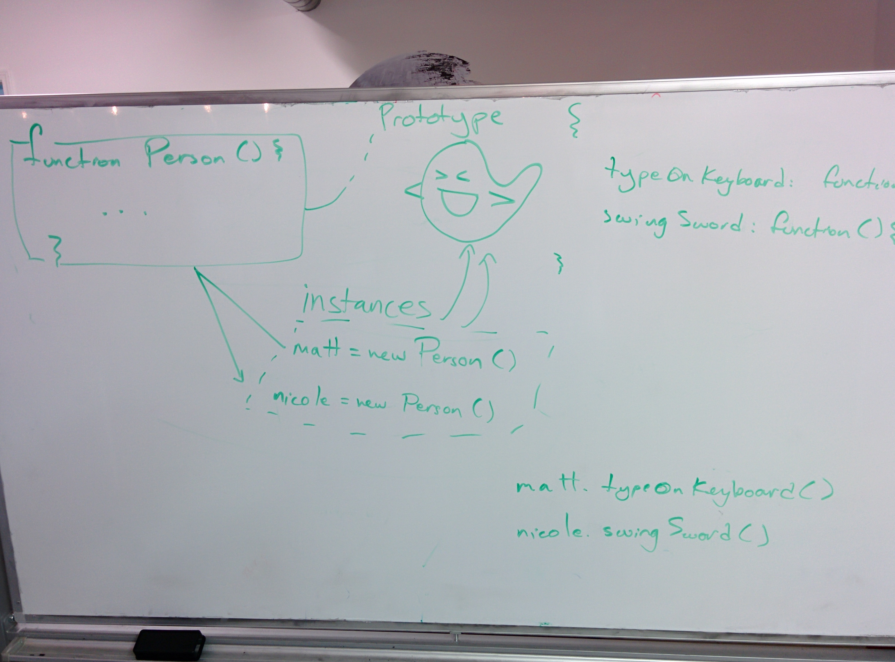

# Week 3

# Objectives

1. [Arrays](#arrays)
- [Date()](#date)
- [String methods](#string-methods)
- [DOM APIs](#dom-apis)
- [jQuery's AJAX functions](#jquerys-ajax-functions)
- [Promises, `$.Deferred`, `$.get/getJSON/ajax/post`](#Promises, `$.Deferred`, `$.get/getJSON/ajax/post`)
- [Combining DOM APIs, loops, and strings to dynamically change content on a Github page](#Combining DOM APIs, loops, and strings to dynamically change content on a Github page)
- [`setInterval()`, `setTimeout()`](#`setInterval()`, `setTimeout()`)
- [`arguments` (variadic behavior)](#`arguments` (variadic behavior))
- [Making Video Games in JavaScript](#Making Video Games in JavaScript)
- [Prototypes, Constructors, and Organizing Code](#prototypes-constructors-and-organizing-code)

---

# Discussion Topics and Homework

### (1.) Monday

**Homework**

1. MLK Day - keep doing weekend assignment.

### (2.) Tuesday

**Homework**

1. [Color Clock](https://github.com/matthiasak/js-assignments/tree/master/color-clock)

### (3.) Wednesday

- AJAX, Promises, and Github API (https://api.github.com/)

**Homework**

1. Review https://github.com/TIY-Houston-Front-End-Engineering/AJAX-1
2. [Github profile](https://github.com/matthiasak/js-assignments/tree/master/github-api-profile)
3. Blog something.

### (4.) Thursday

- AJAX review (`$.when`, `$.get`, `promise.then`)
- Github Profile homework recap
- Templating (seperating our HTML and JS)
- Constructors and Prototypes

**Homework**

1. [Github profile (hard/nightmare mode)](https://github.com/matthiasak/js-assignments/tree/master/github-api-profile)

### (5.) Friday

**Homework**

- Watch and code along with [Making Space Invaders in JS](https://github.com/TIY-Houston-Front-End-Engineering/Notes-Jan-2015/blob/master/week3.md#making-video-games-in-javascript)
- If you run into questions, not only ask your peers/TA/instructor on Hipchat, but write the questions down with example code and:

    1. blog them
    2. bring those questions to class so we can review

---

# Arrays

- creating arrays

    ```js
    var names = ['matt', 'mark', 'mike'];

    // or

    var names = new Array(3);
    name[0] = 'matt';
    name[1] = 'mark';
    name[2] = 'mike';
    ```

- array methods and properties

    - `length`
    - `indexOf` / `lastIndexOf`
    - `push` / `pop`
    - `unshift` / `shift`
    - `join`
    - `forEach`
    - `sort`
    - `reverse`
    - `slice`
    - `filter`
    - `map`
    - `reduce`
    - `concat`

    ```js
    var fruits = [{
        name: "apple",
        color: "red"
    }, {
        name: "strawberry",
        color: "red"
    }, {
        name: "tomato",
        color: "red"
    }, {
        name: "grape",
        color: "red"
    }]

    fruits = fruits.filter(function(fruit){
        return fruit.color === "red";
    }).map(function(fruit){
        return fruit.name;
    })

    console.log(fruits.join(", "));
    ```

# Date()

```js
var x = new Date(),
    y = new Date(1421298156652),
    z = new Date("Wed Jan 14 2015");
    // new Date(year, month[, day[, hour[, minute[, second[, millisecond]]]]]);
```

> See more http://devdocs.io/javascript-date/

# String methods

```js
"a".anchor("test")
"a".bold()
"hello there!".link("test"); //<-- "<a href="test">hello there!</a>"


"    Hi! I'm a string. ".trim(); //<-- "Hi! I'm a string."

"hello".charAt(0); //<-- "h"
"hello"[0]; //<-- "h"

"a".charCodeAt(0); //<-- 97
"b".charCodeAt(0); //<-- 98
"Z".charCodeAt(0); //<-- 90

"Z" < "a"; //<-- true (because "Z"'s charcode is less than "a"' charcode)

String.fromCharCode(97); //<-- "a"

"howdy".indexOf("o"); //<-- 1
"howdy".indexOf("ow"); //<-- 1
"howdy".indexOf("nope"); //<-- -1

"hello there!".length; //<-- 12

"howdy".replace("owd", "ey bab"); //<-- "hey baby"

"hi mi fli whi GI Ri Shi".replace(/i/, "a"); //<-- "ha mi fli whi GI Ri Shi"
"hi mi fli whi GI Ri Shi".replace(/i/ig, "a"); //<-- "ha ma fla wha Ga Ra Sha"
"hi mi fli whi GI Ri Shi".replace(/hi/ig, "a"); //<-- "a mi fli wa GI Ri Sa"

"a-b-c".split(""); //<-- ["a", "-", "b", "-", "c"]
"a-b-c".split("-"); //<-- ["a", "b", "c"]

"hello there!".substr(0, 5); //<-- "hello"
"hello there!".substr(1, 5); //<-- "ello "
"hello there!".substr(2, 5); //<-- "llo t"
"hello there!".substr(3, 5); //<-- "lo th"
"hello there!".substr(4, 5); //<-- "o the"
"hello there!".substr(5, 5); //<-- " ther"
"hello there!".substr(6, 5); //<-- "there"

"i'M AlL FuNKy LoOkINg".toLowerCase(); //<-- "i'm all funky looking"
"i'M AlL FuNKy LoOkINg".toUpperCase(); //<-- "I'M ALL FUNKY LOOKING"
```

# DOM APIs

- `document.querySelector`
- `document.querySelectorAll`
- `document.getElementById`
- `document.getElementByTagName`
- `document.getElementsByClassName`

**what we can edit/read on DOM elements**

- `attributes` on an element `element['attributeName']` (i.e. `element.id`, `element.tagName`, or `element.className`)
- `innerHTML`
- `style`
- and many more...

> See http://devdocs.io/dom/htmlelement for more

# jQuery's AJAX functions

jQuery has some built-in methods of requesting and sending information to and from a server. We covered `$.get()` and `$.getJSON` today. We will get to posting information to a server shortly.

- `$.get(url).then(function(data){...})`

    http://api.jquery.com/jQuery.get/


- `$.getJSON(url).then(function(data){...})`

    http://api.jquery.com/jQuery.getJSON/


- `$.ajax(options).then(function(data){...})`
- `$.post(url).then(function(data){...})`

All of the above methods return a **jQuery Promise** object that has a `then` method. This is how we handle **asynchronous** communications in JavaScript. Promises are used because we don't know when the AJAX request will return (.5s? 1s? 10s? never?).

```js
var githubUsername = "matthiasak";
var url = "https://api.github.com/users/"+githubUsername;
var result = $.get(url);
result.then(function(data){
    // do something with the data retrieved
})
```

# Promises, `$.Deferred`, `$.get/getJSON/ajax/post`

`$.get()` is built on top of a built-in object in JavaScript called `XMLHttpRequest`.

First off, to see how much crazy detail exists for `XMLHttpRequest()`'s, have a look at https://developer.mozilla.org/en-US/docs/Web/API/XMLHttpRequest.

### XMLHttpRequest

Using `XMLHttpRequest` is a bit like this:

```js
var myRequest = new XMLHttpRequest();
myRequest.onload = function(){
    var json = JSON.parse(this.responseText);
    console.log(json);
};
myRequest.open("get", "https://api.github.com/users/matthiasak", true);
myRequest.send();
```

This is actually quite similar to yesterday's `$.getJSON()` example:

```js
$.getJSON("https://api.github.com/users/matthiasak").then(function(data){
    console.log(data);
})
```

### Building our own Promises (but very incomplete)

Both methods still use a `callback` function: `myRequest.onload = ...` and `$.get().then(...)`. This implies some sort of magic that jQuery uses... but really... it isn't magic at all. :-)

Imagine a `Promise` function and prototype:

```js
function Promise(request){}
Promise.prototype.then = function(callback){}
```

Now just assume we can use:

```js
function get(url){
    var myRequest = new XMLHttpRequest();
    var p = new Promise(myRequest);
    myRequest.open("get", url, true);
    myRequest.send();
    return p;
}
````

Then, we can implement the `Promise()` methods:

```js
function Promise(request){
    this.request = request;
}
Promise.prototype.then = function(callback){
    var self = this;
    var feedDataIntoCallback = function(){
        var json = JSON.parse(self.request.responseText);
        callback(json);
    }

    if(this.request.readyState === 4){
        feedDataIntoCallback();
    } else {
        this.request.onload = feedDataIntoCallback;
    }
}
```

Let's string all of that together:

```js
function get(url){
    var myRequest = new XMLHttpRequest();
    var p = new Promise(myRequest);
    myRequest.open("get", url, true);
    myRequest.send();
    return p;
}
function Promise(request){
    this.request = request;
}
Promise.prototype.then = function(callback){
    var self = this;
    var feedDataIntoCallback = function(){
        var json = JSON.parse(self.request.responseText);
        callback(json);
    }

    if(this.request.readyState === 4){
        feedDataIntoCallback();
    } else {
        this.request.onload = feedDataIntoCallback;
    }
}

get("https://api.github.com/users/matthiasak").then(function(data){
    console.log(data);
})
```

Looks a bit more like `$.get()` now!

```js
$.getJSON("https://api.github.com/users/matthiasak").then(function(data){
    console.log(data);
})
```

jQuery provides so much more than `$.get()`. The real power is in the Promises, which are able to not only handle when **one** request finished, but handle **multiple requests in parallel**.

### Handling multiple Promises in parallel

```js
var promise1 = $.get(...);
var promise2 = $.get(...);

$.when(promise1, promise2).then(function(resultsOfPromise1, resultsOfPromise2){
    // ...
})
```

# Combining DOM APIs, loops, and strings to dynamically change content on a Github page

**Live drawing data pulled from `$.get()` to the DOM**

```js
// ---------------------
// Let's draw some info from our github profiles to the screen
// NOTE: you will need jQuery loaded on the page!
// ---------------------
var githubUsername = "matthiasak";
var url = "https://api.github.com/users/"+githubUsername;
$.get(url).then(function(data){
    drawProfile(data);
})
function drawProfile(data) {
    document.body.innerHTML = [
        '<h1>',
        data.name,
        '</h1>',
        '<h2> blog:',
        data.blog,
        '</h2>'
    ].join('')
}
```

# `setInterval()`, `setTimeout()`

Test the following in Chrome dev tools:

```js
var d = new Date(),
    interval = 3000; //1000ms = 1s

var id = setInterval(function() {
    d.setTime(d.getTime() + interval);
    console.log(d.getHours() + ":" + d.getMinutes() + ":" + d.getSeconds());
}, interval);
```

If you want to make the interval stop executing every 3000ms, run:

```js
clearInterval(id);
```

# `arguments` (variadic behavior)

```js
/**
 * sum functions
 */
function sumOnlyTwoNumbers(a, b){
    "use strict";
    return a + b;
}
function sumForLoop(){
    "use strict";
    var args = Array.prototype.slice.apply(arguments, []),
        sum = 0;
    for(var i = 0; i < args.length; i++){
        sum += args[i];
    }
    return sum;
}
function sumForEach(){
    "use strict";
    var args = Array.prototype.slice.apply(arguments, []),
        sum = 0;
    args.forEach(function(num){ sum += num; });
    return sum;
}
function sumForEachCustom(){
    "use strict";
    "use strict";
    var args = Array.prototype.slice.apply(arguments, []),
        sum = 0;
    forEach(args, function(){ sum += arguments[0]; });
    return sum;
}

/**
 * forEach functions
 */
function forEach(array, callback){
    "use strict";
    for(var i = 0; i < array.length; i++){
        callback(array[i], i);
    }
}
Array.prototype.forEach = function(callback){
    "use strict";
    for(var i = 0; i < this.length; i++){
        callback(array[i], i);
    }
}
```

# Making Video Games in JavaScript

Includes topics of:

- `canvas`
- the game loop
- event handling
- and others

Video on "making Space Invaders from scratch": http://vimeo.com/105955605

# Prototypes, Constructors, and Organizing Code

In class, we took the following code (loaded from `app.js`) and explored it in the Chrome Console (shown in the subsequent screenshots):

```js
function Person(username, token){
    this.username = username;
    this.token = token;
}

Person.prototype.typeOnKeyboard = function(){
    console.log(this.username)
}
Person.prototype.swingSword = function(){}
Person.prototype.action3 = function(){}


///////


var matt = new Person("matthiasak", "09053bbd5cd5b90fdfd05055ce45635ea9f676b")
var nicole = new Person("arbolkiri", "09053basldahsbdjabdsjhabsdjhabsdjhabsd")
```

Screenshots of Chrome Console:


Screenshot of whiteboard:



# SOLID

> http://en.wikipedia.org/wiki/SOLID_%28object-oriented_design%29

- Single responsibility, 

    > a class should have only a single responsibility (i.e. only one potential change in the software's specification should be able to affect the specification of the class)

- Open-closed, 

    > software entities … should be open for extension, but closed for modification

- Liskov substitution, 

    > objects in a program should be replaceable with instances of their subtypes without altering the correctness of that program

- Interface segregation,

    > many client-specific interfaces are better than one general-purpose interface

- and Dependency inversion

    > one should “Depend upon Abstractions. Do not depend upon concretions.”

