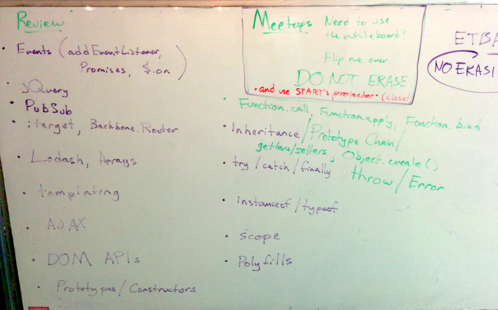

# Week 5

# Objectives

1. jQuery vs. Vanilla JS
- Error Handling
- Constructors, Prototypes, and Inheritance, and the Prototype chain
- Getters/Setters, Object.create
- currying and partial application (Function.call, Function.apply, Function.bind)
- RegEx

---

# Discussion Topics and Homework

- Friday
    + **Homework**
        * Complete the [Regex Coffee assignment](https://github.com/matthiasak/js-assignments/blob/master/regex-coffee/README.md)
        * Watch and blog about: [Writing Testable JS](https://www.youtube.com/watch?v=OzjogCFO4Zo)

---

Overview of our progress at end of Week 5



---

- jQuery vs. Vanilla (from TA lecture Friday afternoon)

    > http://youmightnotneedjquery.com

- Error handling

    > ...is important for robust code.

    Topics:

    - Error objects and extending them,
    - try/catch/finally,
    - throw

    ```js
    console.log( undefined() ); // ERROR: undefined is not a function

    var x = undefined;
    console.log( x() ); // ERROR: undefined is not a function

    // code doesn't break here
    try {
        x();
    } catch(e) {
        console.log(e.message); // ERROR: undefined is not a function
    }

    // code doesn't break here
    try {
        x();
    } catch(e) {
        console.log(e.message); // ERROR: undefined is not a function
    } finally {
        // do something that should always
        // be run after x(), even if there
        // was an error
    }
    ```

    Examples from instruction time:

    ```js
    // try/catch
    // finally
    // throw new Error()

    function Person(name){
        if(!name){
            throw new Error("Name must be given to Person constructor.");
        }
    }

    //////////////

    var sum = 0;
    try {
        var matt = new Person();
        sum = 1 + 2;
    } catch(errorObj){
        console.log(errorObj)
        // send an error message to a server?
        // $.post(..., errorObj)
    }
    console.log(sum); // ---> 0

    //////////////

    var sum = 0;
    try {
        var matt = new Person();
    } catch(errorObj){
        console.log(errorObj);
        // send an error message to a server?
        // $.post(..., errorObj)
    } finally {
        sum = 1 + 2;
    }
    console.log(sum); // ---> 3
    ```

- Constructors, Prototypes, and Inheritance, and the Prototype chain

    > http://bonsaiden.github.io/JavaScript-Garden/#object.prototype

    General approach:

    ```js
        base = new Base();
        Derived.prototype = base; // Must be before new Derived()
        Derived.prototype.constructor = Derived; // Required to make `instanceof` work
    ```

    Example:

    ```js
        function Character(name){
            this.name = name;
        }

        Character.prototype.fight = function(){
            console.log(this.name, this.power);
        }

        function Wizard(name){
            Character.apply(this, arguments);
            this.power = 10;
        }

        Wizard.prototype = new Character();
        Wizard.prototype.constructor = Wizard;
    ```

    Examples from instruction time:

    ```js
    ////////////// Inheritance (Prototypal)

    function Animal(){}
    Animal.prototype = {
        talk: function(){ console.log("hi") }
    }

    ///////

    function Cat(){}
    Cat.prototype = new Animal();
    var garfield = new Cat();
    garfield.talk(); // hi

    //////

    function Dog(){}
    Dog.prototype = new Animal();
    var odie = new Dog();
    odie.talk(); // hi

    ///////

    Animal.prototype.yell = function(){ console.log("OHAI") }
    odie.yell(); // OHAI
    garfield.yell(); // OHAI

    ///////

    Dog.prototype.talk  = function(){ console.log("woof!") }
    odie.talk(); // woof!
    garfield.talk(); // hi

    ///////

    Cat.prototype.talk = function(){
        // call Animal.prototype.talk too?
        Animal.prototype.talk.call(this);
        console.log("I want lasagna");
    }
    odie.talk(); // woof!
    garfield.talk();
    // hi
    // I want lasagna
    ```

- Getters/Setters, Object.create

    ```js
    var o = {
        a: 1,
        get b(){ return this.a + 1 },
        set c(x){ this.a = x/2 }
    }
    ```

- currying and partial application (Function.call, Function.apply, Function.bind)

    Assume we have a function `sum()`:

    ```js
    function sum(c, d){
        return this.a + this.b + c + d;
    }
    ```

    and an object `data`:

    ```js
    var data = {a:1, b:2}
    ```

    - Function.prototype.call

        ```js
        sum.call(data, 3, 4, 'a', 6, 7); // 1 + 2 + 3 + 4
        ```

    - Function.prototype.apply

        ```js
        sum.apply(data, [3, 4, 'a', 6, 7]); // 1 + 2 + 3 + 4
        ```

    - Function.prototype.bind

        ```js
        var sumC = sum.bind(3);
        sumC.apply(data, [4]); // 1 + 2 + 3 + 4

        var sumCD = sumC.bind(4);
        sumCD.apply(data); // 1 + 2 + 3 + 4
        ```

    Examples from instruction:

    ```js
    $("body").on("click", ".left", this.left.bind(this));
    $("body").on("click", ".right", this.right.bind(this));

    // or
    
    var self = this;
    $("body").on("click", ".left", function(){
        self.left()
    });
    $("body").on("click", ".right", function(){
        self.right()
    });
    ```

    ```js
    Function.prototype.bind = function(thisArg){
        var self = this;
        return function(){
            return self.call(thisArg)
        }
    }

    function sum(){ return this.a + this.b }
    sum(); // NaN (undefined + undefined) (window.a + window.b)
    window.a = 1;
    window.b = 2;
    sum(); // 3

    var add5and6 = sum.bind({a: 5, b: 6}); // Function
    add5and6(); // 11
    ```

    ```js
    function sum(){
        var args = Array.prototype.slice.call(arguments)

        return args.reduce(function(prev, next){
            return prev + next
        })
    }

    function avg(){
        var args = Array.prototype.slice.call(arguments)

        return sum.apply(null, args) / args.length;
    }

    avg(1, 2, 3, 4, 5, 6) // 3.5
    ```

- Regular Expressions (or RegExp for short)

    > test your regex with: http://regexpal.com/

    There are four primary functions we're going to look at here:

    1. `String.prototype.replace` -> String
    - `String.prototype.split` -> Array
    - `String.prototype.match` -> Array
    - `RegExp.prototype.test` -> Boolean

    Example use of the first three methods:

    ```js
    "hello".replace("l", "m"); // hemlo
    "How now brown cow".replace("ow", "ai"); // Hai now brown cow

    "hello".split(""); // [h, e, l, l, o]
    "How now brown cow".split(" "); // [How, now, brown, cow]

    "hello".match("e"); // [e]
    "How now brown cow".match(" "); // [" "]
    ```

    Strings are simple, straightforward. Dumb, even.

    The previous code block is exactly similar to the following:

    ```js
    "hello".replace(/l/, "m"); // hemlo
    "hello".replace(/l/g, "m"); // hemmo
    "How now brown cow".replace(/ow/, "ai"); //hai now brown cow
    "How now brown cow".replace(/ow/g, "ai"); //hai nai brain cai

    "hello".split(new RegExp("")); // [h, e, l, l, o]
    "How now brown cow".split(/ /); // [How, now, brown, cow]

    "hello".match(/e/); // [e]
    "How now brown cow".match(/ /); // [ ]
    ```

    The forward slashes (`/.../`) is a shortcut to saying `new RegExp(...)`. These are smarter than strings. They can be used to write patterns, not just exact strings.

    Let's observe the last method which belongs to `RegExp.prototype`:

    ```js
    /a/.test("a"); // true
    /ab/.test("a"); //false
    /ababab/.test("b"); //false
    ```

    The contents of a RegExp object (the '...' in `/.../`) contain a sequence of "characters classes" and decorators.

    "Character classes":

    - any alphanumeric character (a, b, c, A, B, C, 0, 1, 2, etc.)
    - \s (which means whitespace like a 'space', tab, newline character)
    - \d (which means a single digit)
    - . (period) which means a single character of any kind
    - [...] - a specific group that matches any of the characters inside the brackets
        + e.g. `[a-z]` matches one lowercase letter
        + `[0-9abcf-m]` matches a single character that is a digit, 'a', 'b', 'c', or any letter between 'f' and 'm'

    Decorators:

    - ? means the char class before it is optional

        ```js
        "a".match(/ab?/); // [a]
        "ab".match(/ab?/); // [ab]
        "ab?".match(/ab\?/); // [ab?]
        ```

    - * means 0 or more of the preceding class

        ```js
        "".match(/a*/); // [""]
        "a".match(/ab*/); // [a]
        "abbb".match(/ab*/); // [abbb]
        "abbb".match(/a[b]*/); // [abbb]
        ```

    - + means 1 or more of the preceding class

        ```js
        "".match(/a+/); // null
        "a".match(/ab+/); // null
        "abbb".match(/[ab]+/); // [abbb]
        ```

    - parens group classes together for precedence, but don't change anything matched

        ```js
        "".match(/(a*)/); // [""]
        "a".match(/(ab*)/); // [a]
        "abbb".match(/(ab*)/); // [abbb]
        "".match(/(a+)/); // null
        "a".match(/a(b+)/); // null
        "abbb".match(/a(b+)/); // [abbb]
        ```

    - ^ means "not"

        ```js
        "a".match(/[^a]/); // null
        "abbb".match(/[^0-9]+/); // [abbb]
        ```

    - {x} means the preceding class repeats x times, {x,y} means the preceding class repeats between x and y times

        ```js
        "a".match(/[a]{1}/); // [a]
        "abbb".match(/[^0-9]{3}/); // [abb]
        "abbb".match(/[^0-9]{1,}/); // [abbb]
        "abbb".match(/[^0-9]{1,5}/); // [abbb]
        ```

    **More examples**

    ```javascript
    var text = 'The eyes of Texas are upon you.';

    // Will match both "elit" and "elat". The dot can match any character.
    var regex = /./g;
    console.log( text.match(regex) );

    // Will match both "est" and "lest". The question mark makes "l" optional.
    var regex2 = /l?est/g;
    console.log( text.match(regex2) );

    // Match only "cat" and "can", but not "car".
    var text = 'cat car can';
    console.log( text.match(/ca[tn]/g) );

    // Match everything BUT cat and can (notice the ^ symbol)
    console.log( text.match(/ca[^tn]/g) );

    // Here is another example, which matches only the number
    text = 'I would like 8 cups of coffee, please.';
    console.log('How many cups: ' + text.match( /[0-9]/g ));

    // A better, shorter way to write it, using the \d character class
    console.log('How many cups: ' + text.match( /\d/g ));

    // Matching everything BUT the number (will return an array of chars)
    console.log( text.match(/\D/g) );

    //////////--------------

    text = 'Hello people of 1974. I come from the future. In 2015 we have laser guns, hover boards and live on the moon!';

    // Find the years. \d+ will match one or more chars
    var yearRegex = /\d+/g;
    console.log('Years: ', text.match( yearRegex ) );

    // Find all sentences. Our sentences begin with a capital letter and end in either a dot or an exclamation mark.
    // The question mark makes the regex non-greedy. Try removing it.
    var sentenceRegex = /[A-Z].+?(\.|!)/g;
    console.log('Sentences: ', text.match(sentenceRegex) );

    // Find all words that begin with h. We want to match both lower and upper case, so we include the i modifier.
    // Notice the \b for word boundary. Try removing it.
    var hWords = /\bh\w+/ig;
    console.log('H Words: ', text.match(hWords) );


    // Find all words between four and six characters
    var findWords = /\b\w{4,6}\b/g;
    console.log( 'Words between 4 and 6 chars: ', text.match(findWords) );


    // Find words longer than 5 chars
    console.log( 'Words 5 chars or longer: ', text.match(/\b\w{5,}\b/g) );


    // Find words exactly 6 chars long
    console.log( 'Words exactly 6 chars long: ', text.match(/\b\w{6}\b/g) );
    ```

    **Examples that matching groups (not just classes)**

    RegExp keeps track of the groups () it has matched, and automatically numbers them from `$1` to `$n` for n matches.

    **Backreferences**

    ```js
    // Find the words which consist only of the same letters
    var text = 'Abc ddefg, hijk lllll mnopqr ssss. Tuv wxyyy z.';
    var sameLetterRegex = /(\w)\1+/g;
    console.log( text.match(sameLetterRegex) );
    ```

    Aside from matching character patterns in strings, we can use RegExp to to substitute text out (think "find and replace" feature of text editors). We can do this with `String.replace()`.

    **Tokens**

    ```js
    // Let's turn "John Smith" into "Smith, John"
    // Each group (\w+) matches a single word. Each group is assigned
    // an index, starting from $1
    var name = 'John Smith';
    var nameRegex = /(\w+) (\w+)/;
    console.log( name.replace(nameRegex, '$2, $1') );

    // For more advanced manipulations, we need to provide a JS callback.
    // For example, lets make the surname uppercase
    var upcasename = name.replace(nameRegex, function(string, group1, group2){
        return group2.toUpperCase() + ', ' + group1;
    });

    console.log( upcasename );
    ```

    Examples from instruction:

    > RUN THESE AND OBSERVE!!

    ```js
    var isEmail = /[\.a-z-_]+@([a-z-_]+\.)+(com|net|org|edu|io)/ig;
    "matt@theironyard.com".match(isEmail)
    "matt@theironyard".match(isEmail)
    "matt@.com".match(isEmail)
    "matt@theironyard.org".match(isEmail)
    "matt@theironyard.co.nz".match(isEmail)
    ```

    ```js
    function getRegExpFromRoute(route){
        var newRoute = route.replace(/\:[^\/]+/ig, "([^\/]+)")
        return new RegExp(newRoute, "ig");
    }

    var searchRoute = getRegExpFromRoute("#/search/:id")
    searchRoute.exec("hello"); // null
    searchRoute.exec("#/search/") // null
    searchRoute.exec("#/search/1") // ["#/search/1", "1"]
    ```

    ```js
    "John Smith, Matt Keas".replace(/(\w+) (\w+)(,)?/ig, "$2, $1;\n")
    // --> "Smith, John; Keas, Matt;"
    ```

    **Example from Friday review**

    ```js
    /**
     * var html = _.template(data, tmplString)
     * @return String
     */

    var actualTemplate = "https://api.github.com/users/{user}/repos/{repo_url}"

    function template(data, templateString){
        return templateString.replace(/{(\w+)}/g, function(entireMatch, group1, index, str){
            
            if(typeof data[group1] === "undefined") {
                throw new Error("that data don't exist, yo.")
            }

            return data[group1];
        })
    }

    template( { user: "matthiasak", repo_url: "test" }, actualTemplate )
    ```
