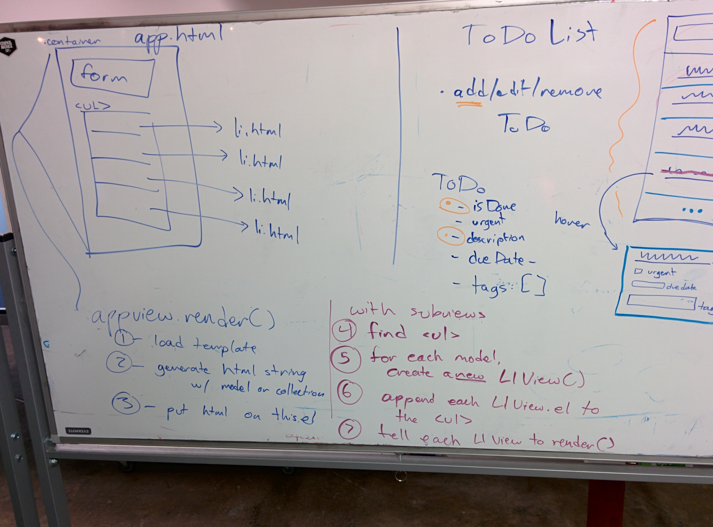

# Week 7

# Objectives

1. Backbone Review and Backbone Source Explained (http://backbonejs.org/docs/backbone.html)
- [REST and Browser APIs](./APIs.md)
- Nested Views are **BAD**
- Parse, Building a "social network" with Parse, Cloud modules with Parse

---

# Discussion Topics and Homework

- Tuesday
    + Reviewed Backbone Events, Models, caching and promises, `Function.prototype.bind`, `Function.prototype.apply`, Routing
    + Reviewed https://github.com/TIY-Houston-Front-End-Engineering/backbone-weather-gps-models-views
    + GH-Pages version: http://tiy-houston-front-end-engineering.github.io/backbone-weather-gps-models-views/
    + Intro'd Backbone Collections today
    + 2pm review: Building a Contacts app in Backbone
    + **Homework**
        * review https://github.com/TIY-Houston-Front-End-Engineering/Backbone-Contacts
        * blog about it
- Wednesday
    + Bacbkbone ToDoList group assignments
- Thursday
    + Continue ToDoList group assignments

---

- Backbone Review

    We are spending a lot of time this week learning how to start and problem-solve with Backbone. Review is provided every morning.

- [REST and Browser APIs](./APIs.md)
- Nested Views are **BAD**

    

- Parse, Building a "social network" with Parse, Cloud modules with Parse

    Parse is a service that, through REST APIs, lets us build "dynamic web apps" without installing and configuring our own databases.

    Parse has a Backbone plugin that overwrites `Backbone.Sync` (the underlying functionality that `save()`, `fetch()`, and `destroy()` use to interact with a REST endpoint.)

    **Using Parse in our apps**

    Our `package.json` has already been updated to run `bower install parse-js-sdk`, and the default `app.js` now includes a commented-out line to load the Parse SDK.

    To use Parse, comment out the Backbone line and uncomment the Parse line:

    ```js
    // load some scripts (uses promises :D)
    loader.load(
        //css
        {url: "./dist/style.css"},
        //js
        {url: "./bower_components/jquery/dist/jquery.min.js"},
        {url: "./bower_components/lodash/lodash.min.js"},
        
        // when using just Backbone, use this line
        {url: "./bower_components/backbone/backbone.js"},
        // when using Parse, comment out the above line and uncomment the line below 
        // {url: "./bower_components/parse-js-sdk/lib/parse.min.js"},
        
        // other stuff
        {url: "./bower_components/pace/pace.min.js"},
        {url: "./js/TemplateView.js"}
    ).then(function(){
        document.querySelector("html").style.opacity = 1;
        // start app?
        // ...
    })
    ```

    **Creating a Parse app**

    > Or converting a regular Backbone app to a Parse app...

    To create a Parse app instead of a regular ol' Backbone app, we'll use these replacements:

    - `Parse.Object = Backbone.Model.extend({ ... })`

        Parse's Objects extend the functionality of the regular Backbone Model.

        To store "Task" domain objects on Parse, we can extend Parse.Object with a `className`:

        ```js
        var Task = Parse.Object.extend({ className: "Task" });
        ```

    - `Parse.Collection = Backbone.Collection.extend({ ... })`

        Parse's Collections extend the functionality of the regular Backbone Collection.

        To store "TodoList" collections on Parse (collections of Task models from above), we can extend Parse.Collection with a pointer to our Task constructor:

        ```js
        var TodoList = Parse.Collection.extend({ model: ParseTodo });

        var todos = new TodoList();

        // Construct a query to get the current user's todo items
        var query = new Parse.Query(ParseTodo);
        todos.query = query;
        todos.fetch();
        ```

    - `Parse.View = Backbone.View`, `Parse.Router = Backbone.Router`, `Parse.History = Backbone.History`

        All the rest of the Backbone pieces will be used the same, but we'll just access them through Parse instead of Backbone.

    > For more information on converting a Backbone app into a Parse app, see https://parse.com/docs/js_guide#convert
    
    **Creating a Parse app**

    Go to https://parse.com/apps, create an account, sign-in, create a new app, go to your settings, and get your "Application ID" and "JavaScript Key". These will be used as your access token in your code.

    In your app, preferably in `app.js`, you will now have:

    ```js
    // load some scripts (uses promises :D)
    loader.load(
        // ...
    ).then(function(){
        document.querySelector("html").style.opacity = 1;
        // connect Parse
        Parse.initialize("app ID here", "js key here");
        // start app?
        // ... new Router?
    })
    ```

    **Other minor changes to our code**

    - [TemplateView](./extras/setup/TemplateView.js) has been updated to extend either Parse.View or Backbone.View, depending on which one exists when TemplateView is loaded.
    - Whenever we do a `Model.set()`, now just add on a `Model.save()` after that to push those changes up to Parse, too.

        **Example:** from ToDoneskis TodoView example:

        ```js
        Parse.TodoView = Parse.TemplateView.extend({
            ...,
            events: {
                "change input[name='isDone']": "toggleIsDone"
            },
            toggleIsDone: function(){
                var m = this.getModelAssociatedWithEvent(e);
                if(m){
                    m.set('isDone', !m.get('isDone'));
                    // adding the following line ...
                    m.save(); // save it to Parse
                    this.render();
                }
            },
            ...
        })
        ```

        **EASY WIN:** instead of remembering to tell a Parse.Object to `save()`, we can tell a Parse.Object to simple `save()` whenever it emits a "change" event:

        ```js
        Parse.Task = Parse.Object.extend({
            className: "Task",
            defaults: {
                isDone: false,
                urgent: false,
                dueDate: null,
                tags: [],
                description: "no description given"
            },
            initialize: function(){
                // adding the following, so that every Parse.Object instance saves itself to Parse when it is changed
                this.on("change", function(){
                    this.save();
                })
            }
        })
        ```

    - Instead of doing `Collection.add()` (which adds a new Model instance to the Collection but **doesn't save to the REST API**), use `Collection.create()` to both add and save to Parse.

        **Example:** from ToDoneskis TodoView example:

        ```js
        Parse.TodoView = Parse.TemplateView.extend({
            ...,
            events: {
                'submit form': 'addTask'
            },
            addTask: function(e){
                e.preventDefault();
                var data = {
                    description: this.el.querySelector('input').value
                }
                // changed this line ...
                //      this.collection.add(data); // add to collection
                // ... to the following line
                this.collection.create(data); // add AND save online
            },
            ...
        })
        ```

    - `Collection.get(cid)` no longer works. Parse Object's still have cid's, but they also have an `id` attribute that should be used instead (e.g. `Collection.get(id)`). 

        Your template should also render id's, not cid's.

        **Example:** template `app.html` from our ToDoneskis example:

        ```html
        <li cid="<%= task.cid %>">

        // change to 

        <li id="<%= task.id %>">
        ```

    **Compare the Backbone and Parse versions of ToDoneskis**
    
    - The Backbone version of ToDoneskis is online here: 
        + https://github.com/TIY-Houston-Front-End-Engineering/ToDoneskis
        + gh-pages: http://tiy-houston-front-end-engineering.github.io/ToDoneskis/
    - The Parse version of ToDoneskis is online here: 
        + https://github.com/TIY-Houston-Front-End-Engineering/Parse-ToDoneskis
        + gh-pages: http://tiy-houston-front-end-engineering.github.io/Parse-ToDoneskis/